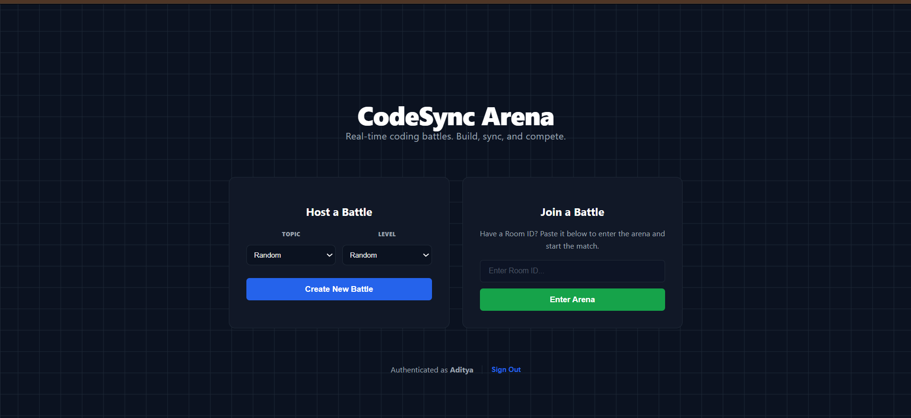
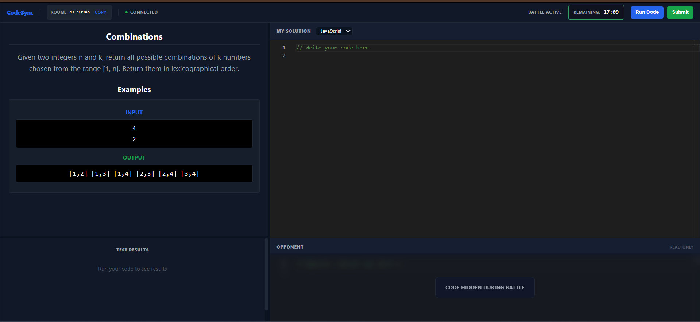

# CodeSync Arena ⚔️

**CodeSync Arena** is a real-time 1v1 competitive coding platform where developers solve DSA problems head-to-head. It combines a synchronized Monaco editor, Socket.IO-based battle events, MongoDB persistence, and Judge0 code execution.



## 🚀 Features

- **Real-time code synchronization** between players using Socket.IO.
- **1v1 room-based battles** with topic and difficulty selection.
- **Multi-language execution** for C++, Java, Python, and JavaScript through Judge0.
- **Live battle experience** with problem assignment, code changes, execution results, and submission handling.
- **Anti-cheat opponent view** with blurred opponent code during the battle.
- **JWT authentication** with bcrypt password hashing.
- **MongoDB persistence** for users, rooms, problem data, and submitted code state.
- **Automatic room cleanup** using a MongoDB TTL index.
- **Responsive dark-themed coding interface** built around Monaco Editor.

## 🛠 Tech Stack

| Layer | Technologies |
| --- | --- |
| Frontend | React, TypeScript, Vite, React Router, Monaco Editor, Axios |
| Real-time | Socket.IO / Socket.IO Client |
| Backend | Node.js, Express, TypeScript |
| Database | MongoDB + Mongoose |
| Authentication | JWT + bcryptjs |
| Code Execution | Judge0 API |
| Styling | Vanilla CSS |

## 🏗 Architecture

```text
┌──────────────────────┐
│   React + Vite UI    │
│  Monaco Editor       │
└──────────┬───────────┘
           │ HTTPS / REST
           │ WebSocket
           ▼
┌──────────────────────┐
│ Node.js + Express    │
│ Socket.IO Server     │
└───────┬────────┬─────┘
        │        │
        │        └──────────────► Judge0 API
        │
        ▼
┌──────────────────────┐
│ MongoDB / Mongoose   │
│ Users • Rooms • Data │
└──────────────────────┘
```

### Main flow

1. A user registers or logs in.
2. The frontend stores the JWT and connects to the Socket.IO server.
3. A host creates a room and selects the battle configuration.
4. Another authenticated user joins with the room ID.
5. Both clients receive the assigned problem and synchronize code changes through Socket.IO.
6. Code is executed through the backend using Judge0.
7. A successful submission ends the match and broadcasts the winner.

## 📁 Project Structure

```text
Code-Sync-Arena-Build/
├── backend/
│   ├── controllers/
│   ├── middleware/
│   ├── models/
│   ├── routes/
│   ├── services/
│   ├── socket/
│   ├── types/
│   ├── index.ts
│   ├── package.json
│   └── tsconfig.json
├── frontend/
│   ├── src/
│   │   ├── components/
│   │   ├── context/
│   │   ├── pages/
│   │   └── services/
│   ├── package.json
│   ├── vercel.json
│   └── vite.config.ts
├── assets/
└── README.md
```

## ⚙️ Local Development

### Prerequisites

- Node.js 20.19+ (or 22.12+)
- MongoDB (local or MongoDB Atlas)
- A Judge0-compatible execution endpoint

### 1. Clone the repository

```bash
git clone https://github.com/Adityaaun/Code-Sync-Arena-Build.git
cd Code-Sync-Arena-Build
```

### 2. Install dependencies

```bash
cd backend
npm install

cd ../frontend
npm install
```

### 3. Configure the backend

Create `backend/.env`:

```env
PORT=5000
MONGO_URI=your_mongodb_connection_string
JWT_SECRET=your_long_random_secret
FRONTEND_URL=http://localhost:5173
```

### 4. Configure the frontend

Create `frontend/.env`:

```env
VITE_API_URL=http://localhost:5000/api
VITE_SOCKET_URL=http://localhost:5000
```

### 5. Run locally

Backend:

```bash
cd backend
npm run dev
```

Frontend (in another terminal):

```bash
cd frontend
npm run dev
```

Open the Vite URL shown in the terminal, normally `http://localhost:5173`.

## ☁️ Production Deployment

CodeSync Arena uses a separate frontend and backend deployment:

- **Frontend:** Vercel
- **Backend:** Render Web Service
- **Database:** MongoDB Atlas

### 1. Deploy MongoDB Atlas

Create a MongoDB Atlas database and copy its connection string. Keep the database credentials private.

### 2. Deploy the backend on Render

Create a **Web Service** from this GitHub repository.

Set:

```text
Root Directory: backend
Build Command: npm ci && npm run build
Start Command: npm start
```

Add these environment variables in Render:

```env
MONGO_URI=your_mongodb_atlas_connection_string
JWT_SECRET=your_long_random_secret
FRONTEND_URL=https://your-vercel-domain.vercel.app
```

`PORT` does not need to be hard-coded on Render; the application reads the platform-provided `PORT` value.

After deployment, verify:

```text
https://your-render-service.onrender.com/health
```

The endpoint should return a JSON response with `status: "ok"`.

### 3. Deploy the frontend on Vercel

Import the same GitHub repository into Vercel.

Set:

```text
Root Directory: frontend
Framework Preset: Vite
Build Command: npm run build
Output Directory: dist
```

Add these Vercel environment variables:

```env
VITE_API_URL=https://your-render-service.onrender.com/api
VITE_SOCKET_URL=https://your-render-service.onrender.com
```

The repository includes `frontend/vercel.json` so React Router routes such as `/battle/:roomId` continue to work when opened or refreshed directly in production.

Deploy the frontend, then use the generated Vercel URL as the Render `FRONTEND_URL` value.

### 4. Final production verification

Test the deployed application in this order:

1. Open the Vercel frontend.
2. Register a new user.
3. Log in and confirm the dashboard loads.
4. Create a battle room.
5. Open the application in a second browser/incognito window.
6. Register/login as a second user.
7. Join the first user's room.
8. Confirm both players receive the same problem.
9. Confirm code changes synchronize in real time.
10. Run code and confirm Judge0 results appear.
11. Submit a correct solution and confirm the match ends with the correct winner.
12. Check the Render `/health` endpoint.

## 🔐 Environment Variables

### Backend

| Variable | Required | Purpose |
| --- | --- | --- |
| `PORT` | No | Render/local server port; Render supplies this automatically. |
| `MONGO_URI` | Yes | MongoDB Atlas/local database connection string. |
| `JWT_SECRET` | Yes | Secret used to sign authentication tokens. |
| `FRONTEND_URL` | Yes in production | Allowed frontend origin for REST and Socket.IO CORS. |

### Frontend

| Variable | Required | Purpose |
| --- | --- | --- |
| `VITE_API_URL` | Yes in production | Backend REST API base URL. |
| `VITE_SOCKET_URL` | Yes in production | Backend Socket.IO server URL. |

**Never commit real `.env` files, database credentials, JWT secrets, or private API keys.**

## 🩺 Backend Health Check

The backend exposes:

```text
GET /health
```

Example response:

```json
{
  "status": "ok",
  "service": "codesync-arena-backend"
}
```

This endpoint is useful for deployment verification and Render health checks.

## 📸 Screenshots

| Dashboard | Battle Arena |
| :--- | :--- |
|  |  |

## 🔮 Future Improvements

- [ ] Redis adapter for horizontally scaled Socket.IO instances.
- [ ] Asynchronous Judge0 execution for longer-running submissions.
- [ ] Global leaderboard and ELO-based matchmaking.
- [ ] Spectator mode.
- [ ] Automated frontend/backend tests and CI checks.

## 💎 Why CodeSync Arena?

CodeSync Arena turns coding practice into a competitive interview-style experience. Instead of solving problems alone, developers work under time pressure while competing against another player with synchronized code, real-time execution feedback, and a clear win condition.

## 👨‍💻 Author

**Aditya Maurya**

- GitHub: [Adityaaun](https://github.com/Adityaaun)
- Email: adityaah.301@gmail.com
